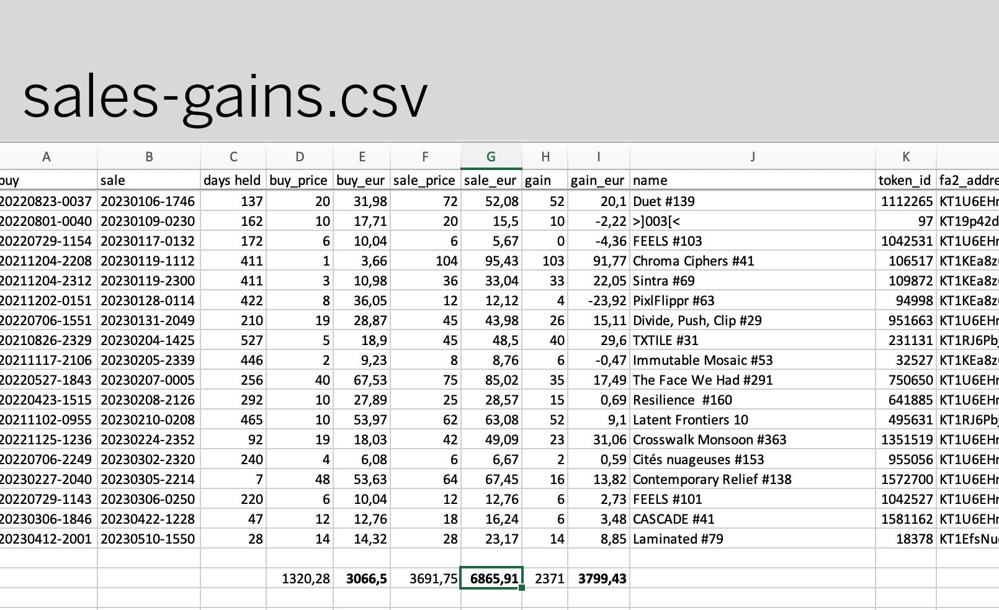

# tezos-tracker

#

Experimental tool to track minted tokens and transactions on Tezos. Uses the [TezTok API](https://www.teztok.com/), leaning heavily on the [example code](https://www.teztok.com/docs/examples) to get an idea of how to get data.

This is a preliminary work-in-progress, most parts (like the Vite app) are incomplete. There is some functional parts related to using the TezTok API in the _src-data/_ folder.

---

### 2023-05-27: Historical EUR prices, sales gains report

Currently generates multiple CSV files of different data related to a wallet:

- **collects.csv**: All collect / buy events for the wallet
- **sales-primary.csv**: Primary sales, lists estimated price in EUR based on Tezos value at time of sale
- **sales-secondary.csv**: All secondary sales, with an estimate of royalties paid (also listed in EUR)
- **sales-other.csv**: Sales of tokens not created by this wallet
- **sales-gains.csv**: If the wallet has secondary sales, this list will compare price at purchase and sell time, with prices listed in EUR as well as Tezos

Also uses aliases for wallets (if available). The next step will be to make the functions more tailored for use in a React app, currently it's all running as Node.js scripts assuming local file access.

---

### 2023-05-23

Basic Tezos data tools can be found in /src-data, specifically _sales.js_ and _index.js_.

Set _artistAddress_ in _index.js_ to the wallet you want.

Run it with _node src-data/index.js_.

CSV Output will go to _output/sales.csv_.
